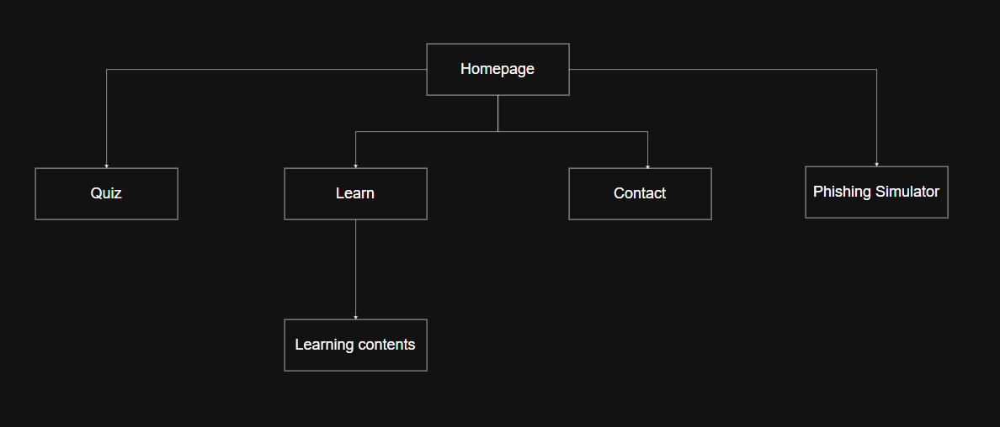
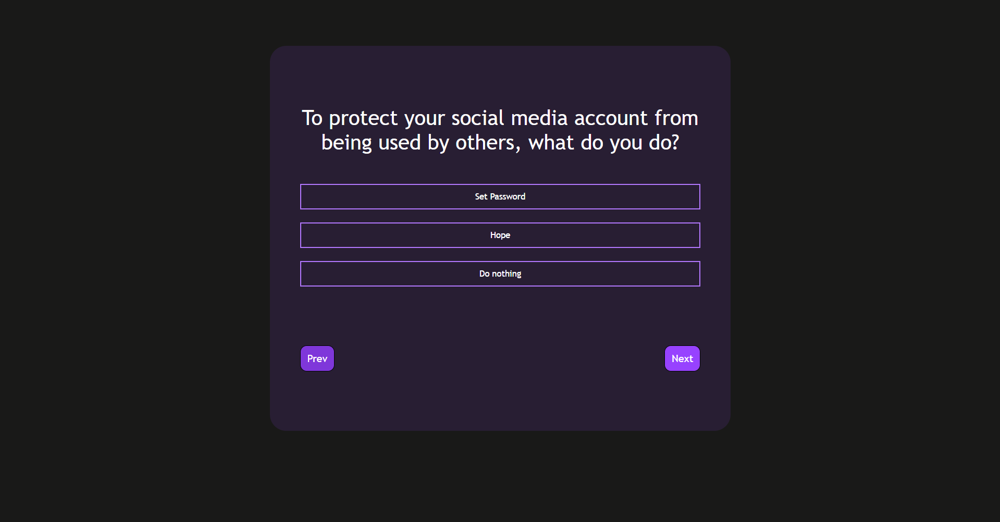
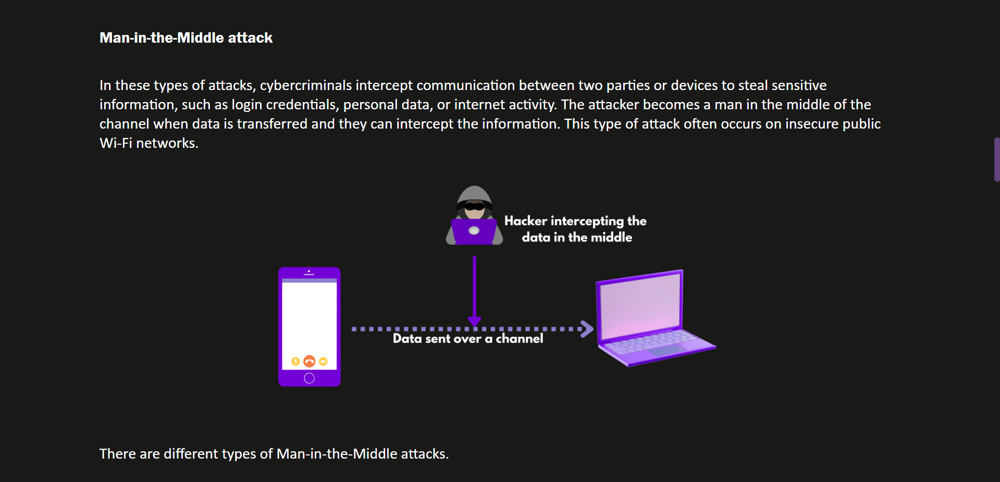
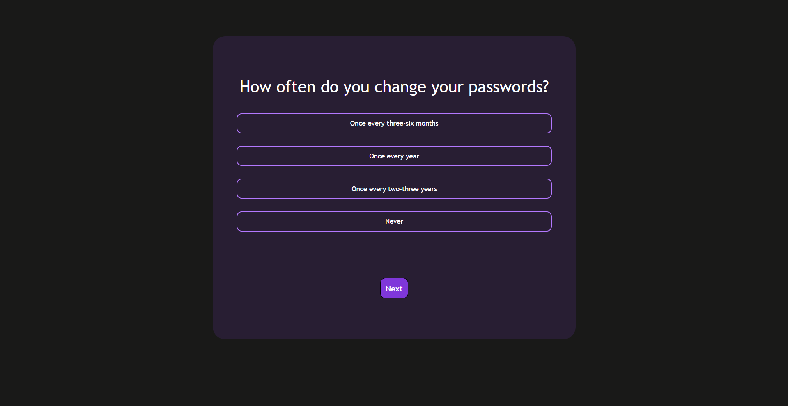

Cyber Kavach is a website designed to provide cybersecurity awareness to people who are new to their cybersecurity career or the employees who need basic understanding of the subject. This website provides knowledge on basic cybersecurity concepts that everyone should know.

Tech:
- HTML
- CSS
- JavaScript

Navigation diagram:

**First Step Learning**
The Cyber Security First Steps is an interactive learning window to start cybersecurity. It provides the very basic foundation for cybersecurity.

**Blogs**
The blogs or learning contents include different cybersecurity concepts to learn.

**Quiz**
The quiz in the homepage is the test for one's secure practices in the digital realm.

**Phishing Simulator**
The phishing simulator is an interactive simulator of phishing attempts.

**Author**

Aayush Dhakal
Bsc (Hons) in Computer Networking and IT Security – Islington College
